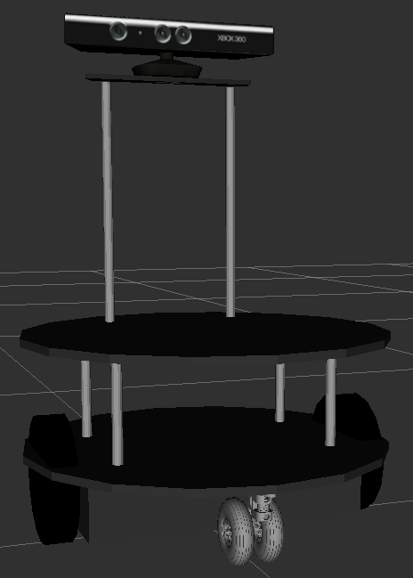

# eddiebot_description


This packages define the urdf model of every eddiebot component for generating `tf` information.


### Package Structure

- [urdf](urdf) folder defined every component of the robot
- [robots](robots) folder builds the robot by using components defined in [urdf](urdf)


### View the Model

Try following command the view the model

```bash
roslaunch eddiebot_rviz_launchers view_model.launch
```

or your can specify the model you want to view by passing a parameter to the launch file

```bash
roslaunch eddiebot_rviz_launchers view_model.launch model:=<model_name>
```


Following models are provided:

- eddie_kinect_v1
- eddie_kinect_v2
- eddie_primesense


Here is an example for the model `eddie_kinect_v1`

